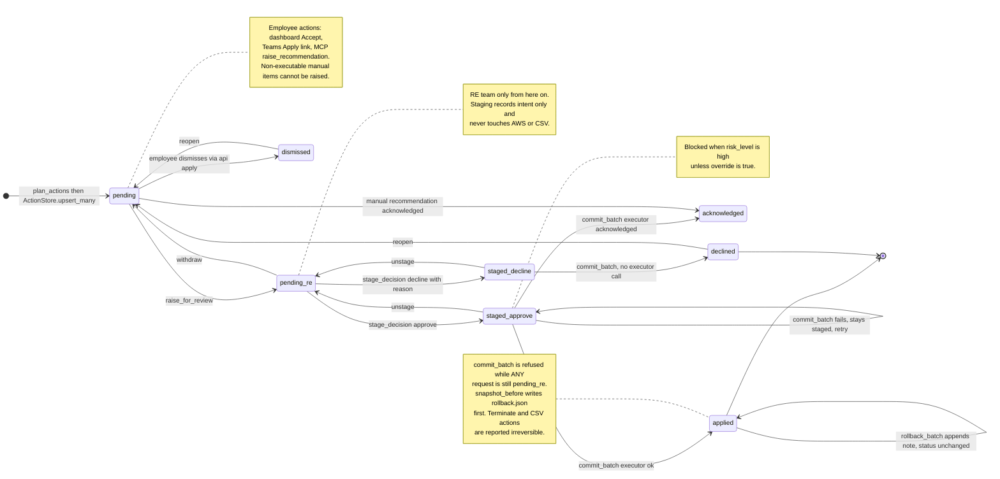
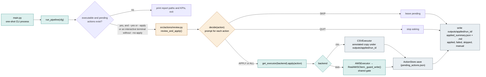
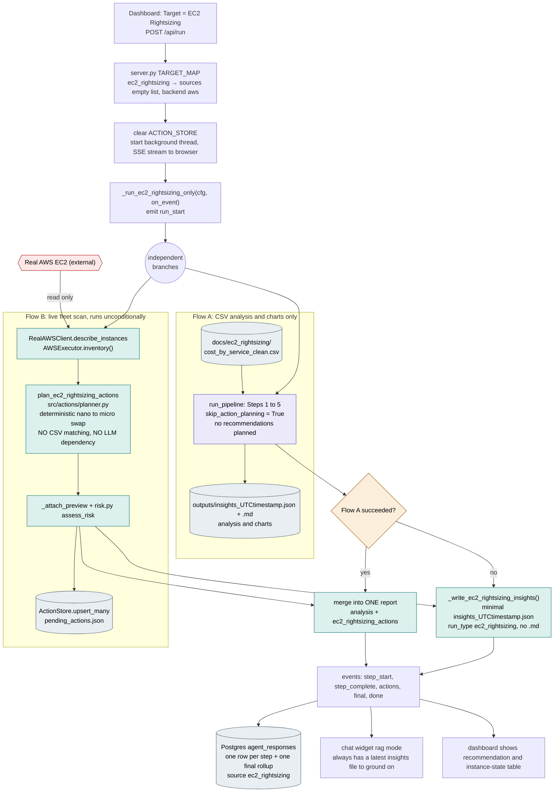
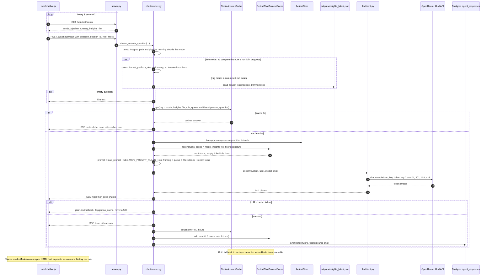
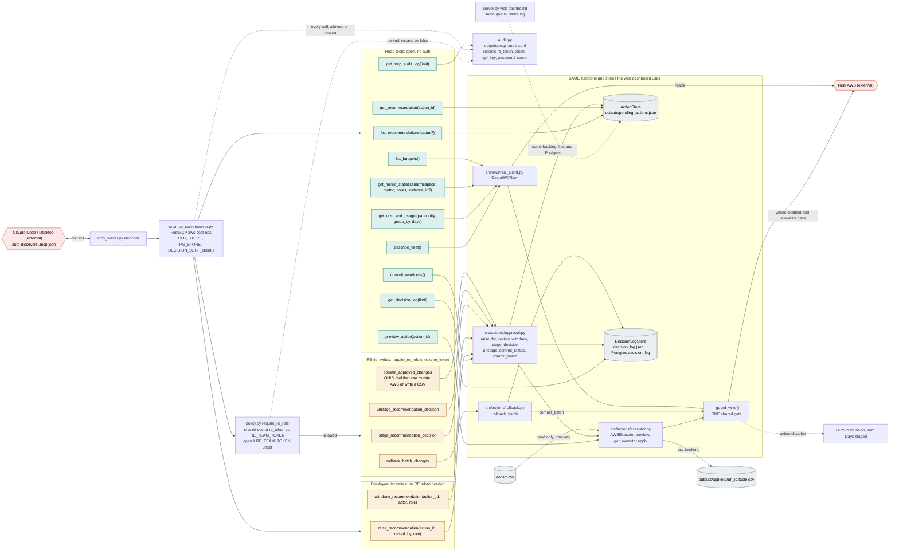

# AWS Cost and Ops Insights Pipeline: Mermaid diagrams

Validated to parse and render with Mermaid 10.9.1. Review before sharing.

## Diagram 1. End-to-end architecture

```mermaid
flowchart TB
  classDef ext fill:#fde8e8,stroke:#b3261e,color:#000
  classDef db fill:#e8eef2,stroke:#51636f,color:#000
  classDef llm fill:#ece9fb,stroke:#5b4fc9,color:#000
  classDef det fill:#dcf0ee,stroke:#0a7772,color:#000
  classDef human fill:#fbeedb,stroke:#a85a07,color:#000
  classDef side fill:#fff3cd,stroke:#b3261e,stroke-dasharray:5 3,color:#000

  CFG["src/config.py + .env (names only)<br/>OPENROUTER_API_KEY, OPENROUTER_API_KEY1<br/>AWS_ACCESS_KEY_ID, AWS_SECRET_ACCESS_KEY, AWS_DEFAULT_REGION<br/>AWS_ALLOW_REAL_WRITES, AWS_WRITE_ALLOWED_REGIONS<br/>AWS_WRITE_REQUIRE_TAG, AWS_WRITE_ALLOWED_INSTANCE_TYPES<br/>ACTION_BACKEND, RE_TEAM_TOKEN<br/>TEAMS_WEBHOOK_URL, PUBLIC_BASE_URL<br/>DATABASE_URL, REDIS_URL"]

  subgraph EXT["External systems"]
    AWS{{"Real AWS (external)<br/>EC2, Cost Explorer, CloudWatch, Budgets"}}
    LLM{{"OpenRouter LLM API (external)"}}
    TEAMS{{"Microsoft Teams (external)<br/>incoming webhook"}}
    CC{{"Claude Code / Desktop (external)<br/>MCP client, reads .mcp.json"}}
  end

  subgraph ENTRY["1. Entry points (all reach the same orchestrator)"]
    CLI["main.py<br/>CLI, one-shot process, no server<br/>--sources --query --docs-folder --notify-teams<br/>--action-backend --apply / --no-apply / --yes"]
    WEB["server.py<br/>ThreadingHTTPServer :8765, HTTP + SSE<br/>APP_CFG, ACTION_STORE, PG_STORE, DECISION_LOG<br/>CHAT_CACHE, CHAT_CONTEXT, CHAT_HISTORY<br/>shared RealAWSClient, 30s fleet-read cache"]
    MCPL["mcp_server.py<br/>STDIO launcher, not a web port"]
  end

  UI["web/ front end (vanilla JS)<br/>/ finops_approval_prototype.html (Employee + RE Team)<br/>/chat index.html + app.js<br/>/apply apply.html<br/>chatbot.js, shared.js, shared.css, chatbot.css"]

  subgraph IN["2. Input sources: src/inputs/"]
    FACT["factory.py<br/>build_sources(cfg)"]
    CSV["local_csv.py LocalCSVSource (DEFAULT)<br/>date window anchored on latest Date in CSV"]
    CE["cost_explorer_api.py CostExplorerSource<br/>DAILY by SERVICE, MONTHLY by REGION<br/>window = real UTC now"]
    CW["cloudwatch_api.py CloudWatchSource<br/>EC2, Lambda, RDS metrics"]
    SP["base.py SourcePayload<br/>common interface"]
  end
  DOCS[("docs/*.csv (pristine, NEVER mutated)<br/>ec2_instance_cost, region_cost<br/>service_daily_cost, tag_cost<br/>ec2_rightsizing/cost_by_service_clean")]

  subgraph ORCH["3. src/orchestrator.py run_pipeline (ACTIVE orchestrator)"]
    E0["run_start event"]
    INPF["Inputs: build_sources(cfg), then each .fetch()"]
    S1["Step 1 step1_normalize.py<br/>validate, dedup, normalize<br/>then ONE LLM call (model_normalize) → schema_map<br/>raw records pass through unchanged"]
    S2["Step 2 step2_context_load.py (no LLM)<br/>enrich_records, detect_anomalies → anomaly_signals<br/>correlations by service, region, date, instance_type, project_tag<br/>business_metadata, compact_context → shared context"]
    subgraph GA["PARALLEL GROUP A: ThreadPoolExecutor, 3 workers, deterministic, NO LLM, never raise"]
      FA["run_forecast_agent<br/>capabilities/forecasting.py<br/>→ context.forecast"]
      TG["run_tag_governance_agent<br/>capabilities/tag_governance.py<br/>→ context.tag_findings"]
      RCA["run_root_cause_agent<br/>capabilities/root_cause.py<br/>→ context.anomaly_signals"]
    end
    KPI["_baseline_kpis(context)<br/>deterministic KPIs"]
    subgraph GB["PARALLEL GROUP B: ThreadPoolExecutor, 5 workers, ALL LLM calls, independent, read only context"]
      B1["run_step3_1_charts<br/>chart specs, model_charts tier"]
      B2["run_cost_anomaly<br/>narrates anomaly_signals, capable tier"]
      B3["run_budget_forecast<br/>narrates forecast, capable tier"]
      B4["run_optimisation_recommendation<br/>recommendations from anomalies, tag findings, KPIs, capable tier"]
      B5["run_usage_report<br/>factual usage summary, model_cheap tier"]
    end
    AN["analysis = kpis, anomalies, trends, benchmarks,<br/>forecast, tag_findings,<br/>optimization_recommendations, usage_report"]
    S33["Step 3.3 step3_3_summary.py<br/>LLM model_summary via complete_json, up to 3 retries<br/>falls back to _fallback_summary()"]
    S4["Step 4 step4_combine.py<br/>resolve chart specs into x,y points → combined"]
    S5["Step 5 step5_finalize.py<br/>render Markdown, attach MetadataTracker snapshot"]
    EVF["actions + final events"]
  end

  CAP1["capabilities/: validation.py, deduplication.py, normalization.py"]
  CAP2["capabilities/: enrichment.py, anomaly_detection.py<br/>z-score greater than 2.0 per table and dimension"]
  META["capabilities/metadata.py MetadataTracker<br/>audit trail of sources and stages"]
  GRAPH["src/orchestrator_graph.py<br/>FOOTNOTE: LangGraph rebuild of the SAME flow<br/>built and tested, NOT wired into main.py or server.py<br/>still uses legacy step3_2_analysis.py"]

  INS[("outputs/insights_UTCtimestamp.json + .md")]

  subgraph LLML["LLM layer"]
    LC["src/llm/client.py LLMClient<br/>complete, complete_json (3x), stream (SSE)<br/>key 1 then key 2 on 401, 402, 403, 429 or 200-with-error"]
    PL["src/prompts/loader.py + src/prompts/*.md<br/>step1_normalize, step3_1_charts, step3_2_analysis (legacy)<br/>step3_3_summary, run_cost_anomaly, run_budget_forecast<br/>run_optimisation_recommendation, run_usage_report<br/>risk_assessment, chat_info_intro, chat_rag_intro<br/>chat_negative_rules, chat_platform_description<br/>chat_role_employee, chat_role_re_team"]
  end

  subgraph PLANS["4. Action planning"]
    PLAN["src/actions/planner.py plan_actions<br/>entity catalog → executable row action, else manual acknowledge-only<br/>plus nano/micro fleet swap when backend is aws"]
    PREV["_attach_preview → executor.preview<br/>op, targets, calls, estimated savings"]
    RISK["src/actions/risk.py assess_risk<br/>Env=prod → high, resize/stop/terminate → medium, else low<br/>optional LLM one-line reason only"]
    STORE[("ActionStore<br/>outputs/pending_actions.json<br/>upsert_many keeps human-decided items")]
    NOTIFY["src/integrations/teams.py notify_teams<br/>only if TEAMS_WEBHOOK_URL is set"]
  end

  subgraph APR["5. Approval workflow: src/actions/"]
    APPR["approval.py TWO-STAGE (primary)<br/>raise_for_review, withdraw, reopen<br/>stage_decision, unstage, commit_status, commit_batch"]
    REV["review.py SINGLE-STAGE (CLI only)<br/>APPLY, SKIP, ALL, QUIT prompts"]
    EXE["executor.py<br/>get_executor(backend).apply"]
    CSVX["CSVExecutor<br/>writes annotated COPY of table"]
    AWSX["AWSExecutor<br/>stop, start, resize, terminate, tag, set_budget"]
    RBK["rollback.py<br/>snapshot_before, write_batch_snapshot, rollback_batch"]
    DLOG["decision_log.py DecisionLogStore<br/>decision_log.json capped at 500"]
  end
  subgraph AWSL["6. AWS integration: src/aws/"]
    RC["real_client.py RealAWSClient<br/>lazy boto3: ec2, budgets, sts, cloudwatch<br/>reads always allowed once credentials exist"]
    GUARD["_guard_write()<br/>ONE shared gate for web, MCP and CLI<br/>AWS_ALLOW_REAL_WRITES + region, tag, instance-type allowlists"]
    PRICE["pricing.py<br/>static hourly prices, smaller_type()"]
  end
  DRY["logged DRY-RUN no-op<br/>action stays staged_approve, retryable"]

  subgraph MCPS["7. MCP server: src/mcp_server/"]
    MCP["server.py FastMCP aws-cost-ops<br/>18 tools, see Diagram 5"]
    POL["policy.py require_re_role<br/>shared secret re_token vs RE_TEAM_TOKEN"]
    AUD["audit.py<br/>outputs/mcp_audit.jsonl, secrets redacted"]
  end

  subgraph CHATL["10. Chat: src/integrations/chat/"]
    CHATANS["answer.py<br/>info mode or rag mode, see Diagram 4"]
    CHATM["memory.py<br/>AnswerCache 1h, ChatContextCache 8 turns 6h<br/>ChatHistoryStore<br/>in-process dict fallback if Redis is down"]
  end

  subgraph DOCKER["docker-compose.yml"]
    PG[("Postgres 16 (db)<br/>named volume arrk_pg_data, durable<br/>agent_responses, decision_log<br/>src/storage/postgres.py, best effort")]
    RED[("Redis 7<br/>persistence disabled, no volume<br/>wiped on every restart")]
  end
  OUTCSV[("outputs/applied/run_id/table.csv")]
  SUM[("outputs/applied/run_id/applied_summary.json + .md")]
  ROLLF[("outputs/applied/batch_id/rollback.json")]

  subgraph SIDE["8. Standalone operator tools (NOT part of the main flow)"]
    SCR1["scripts/count_running_instances.py<br/>read-only listing"]
    SCR2["scripts/resize_instance.py<br/>stop, resize, start"]
  end

  EC2R["server.py _run_ec2_rightsizing_only()<br/>see Diagram 3"]

  CFG -.->|"load_config()"| CLI
  CFG -.->|"load_config()"| WEB
  CFG -.->|"load_config()"| MCP
  CFG -.-> LC
  CFG -.-> GUARD

  CLI -->|"run_pipeline(cfg)"| E0
  WEB -->|"POST /api/run, background thread, SSE"| E0
  WEB -->|"Target is ec2_rightsizing"| EC2R
  EC2R -->|"Flow A: run_pipeline, skip_action_planning"| E0
  EC2R -->|"Flow B: plan_ec2_rightsizing_actions"| PLAN
  WEB <-->|"serves pages, fetch + SSE"| UI
  CC <-->|"STDIO"| MCPL
  MCPL --> MCP

  E0 --> INPF --> FACT
  FACT --> CSV
  FACT --> CE
  FACT --> CW
  DOCS -->|"read *.csv"| CSV
  AWS -->|"get_cost_and_usage"| CE
  AWS -->|"get_metric_statistics"| CW
  CSV --> SP
  CE --> SP
  CW --> SP
  SP -->|"list of SourcePayload"| S1
  CAP1 -.-> S1
  CAP2 -.-> S2
  META -.->|"record_source"| INPF
  META -.->|"snapshot"| S5
  S1 --> S2
  S2 --> FA
  S2 --> TG
  S2 --> RCA
  FA --> KPI
  TG --> KPI
  RCA --> KPI
  KPI --> B1
  KPI --> B2
  KPI --> B3
  KPI --> B4
  KPI --> B5
  B2 --> AN
  B3 --> AN
  B4 --> AN
  B5 --> AN
  AN --> S33
  S33 --> S4
  B1 -->|"chart specs"| S4
  S4 --> S5
  S5 --> INS
  S5 -->|"unless skip_action_planning"| PLAN
  PLAN --> PREV --> RISK
  PLAN -->|"upsert_many"| STORE
  PLAN -.->|"live fleet scan via AWSExecutor.inventory"| RC
  S33 -.->|"recommendations feed planning"| PLAN
  PLAN --> NOTIFY
  NOTIFY --> EVF
  NOTIFY -->|"Adaptive Card POST"| TEAMS
  TEAMS -->|"Action.OpenUrl /apply?id=...&decision=apply or dismiss"| UI
  GRAPH -.-|"dormant alternate"| E0

  S1 --> LC
  B1 --> LC
  B2 --> LC
  B3 --> LC
  B4 --> LC
  B5 --> LC
  S33 --> LC
  RISK --> LC
  CHATANS --> LC
  PL -.->|"load_prompt by every LLM stage"| LC
  LC --> LLM

  WEB -->|"/api/apply, /api/actions/raise, withdraw, reopen"| APPR
  WEB -->|"RE-only stage, unstage, commit, rollback<br/>X-RE-Token header vs RE_TEAM_TOKEN"| APPR
  MCP --> POL
  POL -->|"allowed"| APPR
  MCP -.->|"every call, allowed or denied"| AUD
  MCP -.->|"read tools"| STORE
  MCP -.->|"read tools"| RC
  CLI -->|"if executable recommendations exist"| REV
  APPR <-->|"status changes"| STORE
  REV --> STORE
  REV --> EXE
  APPR -->|"commit_batch"| EXE
  APPR --> RBK
  APPR --> DLOG
  RBK --> DLOG
  REV --> SUM
  EXE --> CSVX
  EXE --> AWSX
  DOCS -->|"read only, one-way"| CSVX
  CSVX --> OUTCSV
  AWSX --> GUARD
  RBK -->|"start, resize back, restore tags"| GUARD
  RBK --> ROLLF
  GUARD -->|"writes enabled and allowlists pass"| AWS
  GUARD -.->|"writes disabled"| DRY
  RC --- GUARD
  PRICE -.-> RC
  DLOG -->|"mirror"| PG
  WEB -->|"per-step rows + final rollup"| PG

  WEB -->|"/api/chat, /api/chat/stream"| CHATANS
  CHATANS <--> CHATM
  CHATM --> RED
  CHATM --> PG
  INS -.->|"latest by filename sort"| CHATANS
  STORE -.->|"live queue snapshot"| CHATANS

  SCR1 -.->|"boto3 directly"| AWS
  SCR2 -.->|"boto3 directly, bypasses approval and write guard"| AWS

  class AWS,LLM,TEAMS,CC ext
  class PG,RED,DOCS,INS,STORE,OUTCSV,SUM,ROLLF db
  class S1,B1,B2,B3,B4,B5,S33,LC llm
  class S2,FA,TG,RCA,KPI,S4,S5,CAP1,CAP2,META det
  class APPR,REV,PLAN,RISK human
  class SCR1,SCR2,GRAPH side
```

## Diagram 2. Two-stage approval lifecycle (web and MCP)

## Diagram 2b. Single-stage CLI apply flow (separate, not merged)

## Diagram 3. EC2 Rightsizing dual-flow merge

## Diagram 4. Chat grounded-answer flow

## Diagram 5. MCP server tool surface

