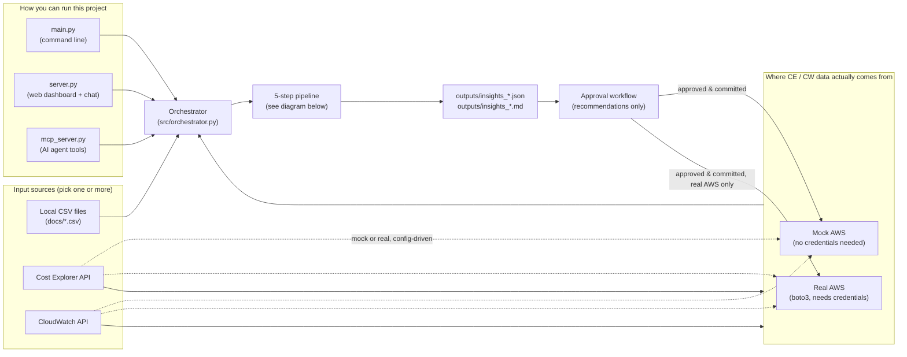
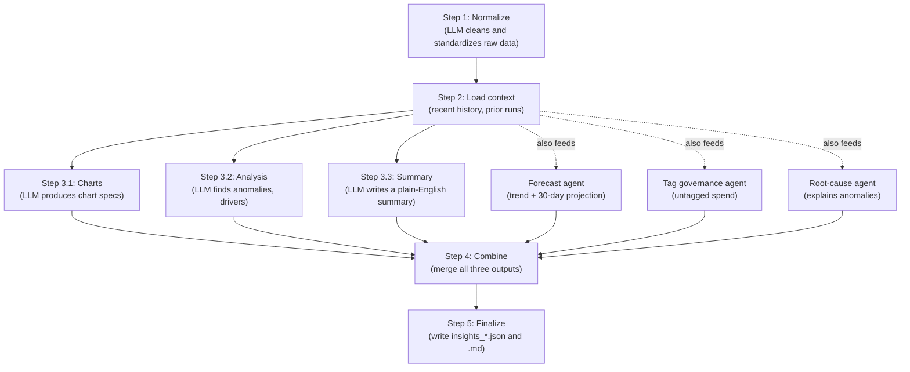
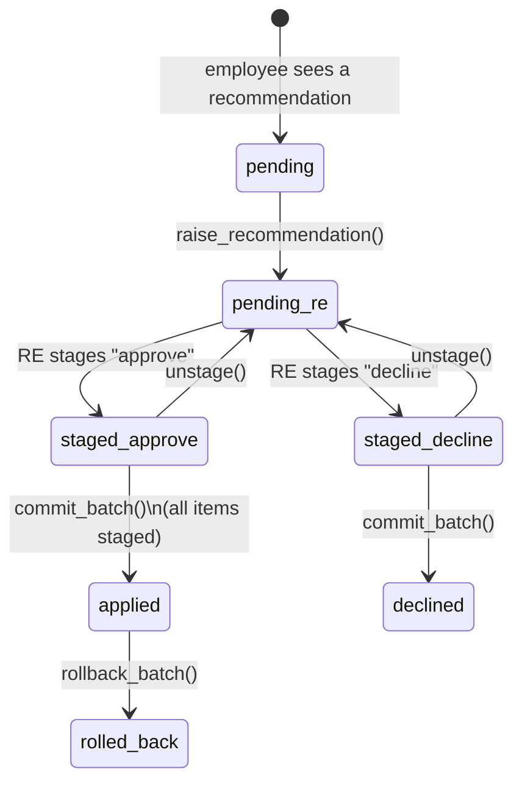

# AWS Cost & Ops Insights Pipeline

A modular, LLM-augmented pipeline that turns raw AWS cost and operations data
into a structured insight report: key metrics (KPIs), anomalies, cost-saving
recommendations, and chart specifications ready for a dashboard.

This document is written for readers who are new to the project. It explains
what the system does, the concepts it relies on, how the pieces fit together,
and how to run it step by step.

## Table of contents

1. [What this project does](#what-this-project-does)
2. [Key concepts for beginners](#key-concepts-for-beginners)
3. [Architecture overview](#architecture-overview)
4. [Directory layout](#directory-layout)
5. [Prerequisites](#prerequisites)
6. [Installation](#installation)
7. [Running the project](#running-the-project)
8. [Environment variables reference](#environment-variables-reference)
9. [Mock AWS (credential-free, real-time)](#mock-aws-credential-free-real-time)
10. [Switching to real AWS](#switching-to-real-aws)
11. [The approval workflow (human-in-the-loop)](#the-approval-workflow-human-in-the-loop)
12. [The MCP server (AI agent access)](#the-mcp-server-ai-agent-access)
13. [Testing](#testing)
14. [Troubleshooting / FAQ](#troubleshooting--faq)
15. [Security notes](#security-notes)

---

## What this project does

Every day, a company's AWS bill produces cost data broken down by service,
region, instance type, and project tag. This project reads that data (from a
CSV export, or directly from AWS), asks a Large Language Model (LLM) to
analyze it, and produces:

- A set of **KPIs** (for example, total spend, week-over-week change).
- **Anomalies** (unexpected cost spikes) and a best-guess **root cause**.
- A 30-day **cost forecast**.
- **Tag governance** findings (spend that is not attributed to any project).
- Human-readable **recommendations** (for example, "resize this
  over-provisioned instance") that a person can review and approve before
  anything actually changes in AWS.

The project can be used in three ways, all built on the same underlying
pipeline:

- As a **command-line tool** (`main.py`) that produces a report file.
- As a **web dashboard** (`server.py`) with a chat interface and an approval
  screen for a "Resource Efficiency" (RE) reviewer.
- As an **MCP server** (`mcp_server.py`) that lets an AI agent such as Claude
  Code or Claude Desktop read the same data and drive the same approval
  workflow through tool calls.

Nothing in this project can change a real AWS account by accident: every
mutating action (stopping an instance, resizing it, changing a budget) passes
through an explicit human approval step and a set of safety guardrails
described later in this document.

## Key concepts for beginners

| Term | Meaning in this project |
| --- | --- |
| **Pipeline** | The fixed sequence of steps that turns raw cost data into a finished report. See [Architecture overview](#architecture-overview). |
| **LLM** | Large Language Model. This project calls one through the [OpenRouter](https://openrouter.ai/) API to normalize data, write summaries, and generate recommendations. |
| **Orchestrator** | The piece of code that runs the pipeline steps in the right order, some in sequence and some in parallel. Two implementations exist here, see below. |
| **LangGraph / LangChain** | Libraries for building multi-step, multi-agent LLM applications as a graph of steps. This project has an LLM-orchestrator built with plain Python (`src/orchestrator.py`, currently active) and an equivalent one built with LangGraph (`src/orchestrator_graph.py`, tested but not yet switched on — see its own docstring). |
| **Mock AWS** | A small built-in fake AWS server that responds like the real AWS APIs but needs no AWS account or credentials. Used for demos and safe testing. |
| **boto3** | The official AWS SDK for Python. Used to call the *real* AWS APIs when Mock AWS is turned off. |
| **MCP (Model Context Protocol)** | An open protocol that lets an AI assistant (like Claude) call a program's functions as "tools" in a controlled way. `mcp_server.py` exposes this project's read and approval functions as MCP tools. |
| **RE team** | "Resource Efficiency" team — the human role in this project that reviews and approves cost-saving recommendations before they are applied. |
| **Recommendation lifecycle** | The staged approval process a recommendation goes through: raised, staged (approved or declined), then committed (applied). See [The approval workflow](#the-approval-workflow-human-in-the-loop). |

## Architecture overview

### End-to-end system

The three entry points (CLI, web server, MCP server) all call the same
orchestrator, which reads from one of three interchangeable input sources
and writes a report to `outputs/`.



### The 5-step pipeline

This is the core of `src/orchestrator.py` and `src/pipeline/`. Steps 3.1,
3.2, and 3.3 run **in parallel** because they are independent analyses over
the same normalized data.



Around this core flow, several "added capabilities" run automatically:
**data validation**, **deduplication**, **normalization**, **enrichment**,
and **metadata tracking** — all configurable in `src/config.py`.

## Directory layout

```
arrk_docs_agent_aws/
├── main.py                  # CLI entry point — run the pipeline from a terminal
├── server.py                # Web dashboard + chat + approval API (Server-Sent Events)
├── mock_aws.py               # Standalone launcher for the credential-free Mock AWS server
├── mcp_server.py              # Launches the MCP server (stdio transport, for AI agents)
├── pyproject.toml / uv.lock   # Dependencies, managed with uv
├── .mcp.json                  # Tells Claude Code/Desktop how to start mcp_server.py
├── docs/                       # Local CSV inputs (default data source)
│   ├── ec2_instance_cost.csv
│   ├── region_cost.csv
│   ├── service_daily_cost.csv
│   └── tag_cost.csv
├── outputs/                    # Generated reports + outputs/mock_state.json (git-ignored)
├── scripts/
│   ├── smoke_test.py           # End-to-end test: raise → stage → commit → verify → rollback
│   └── mcp_smoke_test.py       # Same, through the MCP tools + RE-token gate
├── tests/                       # unittest suite — no LLM calls, no network calls
├── web/                          # Static HTML/CSS/vanilla JS front end (no build step)
│   ├── finops_approval_prototype.html   # served at "/" — RE team approval dashboard
│   ├── index.html                        # served at "/chat" — chat-driven pipeline UI
│   ├── apply.html                        # one-click "Apply" confirmation page (from Teams links)
│   └── app.js, shared.js, chatbot.js, *.css
└── src/
    ├── config.py                 # PipelineConfig — all settings and .env values
    ├── orchestrator.py            # Runs the 5-step flow (currently active)
    ├── orchestrator_graph.py      # LangGraph rebuild of the same flow (tested, not yet wired in)
    ├── inputs/                     # Input source connectors — same interface, different backend
    │   ├── base.py
    │   ├── local_csv.py            # ACTIVE by default
    │   ├── cost_explorer_api.py    # Mock (default) or real boto3
    │   ├── cloudwatch_api.py       # Mock (default) or real boto3
    │   └── factory.py
    ├── mock_aws/                    # Credential-free fake AWS
    │   ├── pricing.py               # instance-type → hourly price table
    │   ├── state.py                 # mutable EC2 fleet, seeded from the CSVs
    │   ├── server.py                # AWS-shaped REST server + live browser console
    │   └── client.py                # thin HTTP client (drop-in boto3 replacement)
    ├── aws/
    │   └── real_client.py           # boto3 client with a hard write-guardrail
    ├── actions/                      # Human-in-the-loop: recommendation → approval → apply
    │   ├── models.py, planner.py, store.py, review.py
    │   ├── approval.py               # raise → stage → commit_batch
    │   ├── rollback.py               # undo a committed batch
    │   ├── risk.py                   # blast-radius guardrail
    │   ├── executor.py               # CSVExecutor / AWSExecutor
    │   └── decision_log.py           # permanent audit trail
    ├── mcp_server/
    │   ├── server.py                 # MCP tool definitions
    │   ├── policy.py                  # RE-role authorization
    │   └── audit.py                    # append-only audit log (redacts secrets)
    ├── pipeline/                      # The 5 pipeline steps, one file each
    ├── capabilities/                   # Validation, dedup, normalization, enrichment, metadata,
    │                                    # plus the forecast / tag-governance / root-cause agents
    ├── chat/                           # Chat widget: Q&A grounded in the latest run's report
    ├── integrations/
    │   └── teams.py                     # Microsoft Teams webhook notifications
    ├── llm/
    │   └── client.py                     # OpenRouter API wrapper (streaming + JSON helpers)
    └── utils/
        └── logger.py
```

## Prerequisites

- **Python 3.11 or newer.**
- **[uv](https://docs.astral.sh/uv/)** — the package manager this project is
  set up for. Install it once per machine:
  ```bash
  # macOS / Linux
  curl -LsSf https://astral.sh/uv/install.sh | sh
  # Windows (PowerShell)
  powershell -ExecutionPolicy ByPass -c "irm https://astral.sh/uv/install.ps1 | iex"
  ```
  `pip install <packages>` also works if `uv` is not available (see below),
  but `uv` is the tested, recommended path because it reads `uv.lock`.
- **An OpenRouter API key** (free tier available at
  [openrouter.ai](https://openrouter.ai/)) — required for every LLM-powered
  step. Without it, the pipeline cannot run.
- **Git**, to clone the repository.
- AWS credentials are **not** required to try the project — the built-in
  Mock AWS server stands in for a real account until you choose otherwise.

## Installation

```bash
# 1. Clone the repository (skip if you already have it)
git clone https://github.com/kuldeepjeengar123/cloud-cost-optimization.git
cd cloud-cost-optimization

# 2. Install dependencies
uv sync
# or, without uv:
pip install python-dotenv requests boto3 mcp redis langgraph langchain-core

# 3. Create a .env file in the project root and add your LLM key
echo OPENROUTER_API_KEY=sk-or-your-key-here > .env
```

Review the [environment variables reference](#environment-variables-reference)
below for every other optional setting. **Before running anything, review the
`.env` file to confirm no confidential values are committed to git** — it is
already listed in `.gitignore`.

## Running the project

There are four independent programs. Start only the ones you need.

| Command | What it does | Address |
| --- | --- | --- |
| `python main.py` | Runs the pipeline once from the terminal and writes a report to `outputs/`. | — |
| `python server.py` | Starts the web dashboard: chat UI, RE approval screen, and the HTTP/SSE API. Auto-starts Mock AWS in-process when that source is selected. | `http://127.0.0.1:8765` |
| `python mock_aws.py` | Starts the standalone Mock AWS server with a live browser console for manually stopping/starting/resizing instances. Optional — only needed to watch the fleet directly. | `http://127.0.0.1:8788` |
| `python mcp_server.py` | Starts the MCP server over stdio so an AI agent (Claude Code, Claude Desktop) can call its tools. Already configured in `.mcp.json`. | — (stdio, not a web port) |

### 1. Command-line report

```bash
python main.py
```

This reads the default local CSV data, runs the full pipeline, and prints
the paths to the generated `outputs/insights_<timestamp>.json` and `.md`
files, along with any recommended actions. If any recommendations are
executable, you will be prompted interactively to approve or skip each one.

Useful flags:

```bash
# Ask a specific question instead of the default summary
python main.py --query "Which service drove the biggest cost spike this month?"

# Point at a different folder of CSV files
python main.py --docs-folder /path/to/other/csvs

# Read from Mock AWS instead of local CSV, and allow it to act on the fleet
python main.py --sources cost_explorer cloudwatch --action-backend aws --apply
```

### 2. Web dashboard

```bash
python server.py
```

Open `http://127.0.0.1:8765` in a browser. Three pages are available:

- **`/`** — the RE team's approval dashboard (`web/finops_approval_prototype.html`): shows the queue of raised recommendations, lets a reviewer stage each one as approve/decline, and commits the whole batch at once.
- **`/chat`** — the chat-driven pipeline UI (`web/index.html`): pick a data source (Local CSV or Mock AWS live), ask a question, and watch the pipeline run live.
- **`/apply`** — a one-click confirmation page opened from a Microsoft Teams notification link.

### 3. Mock AWS live console (optional)

```bash
python mock_aws.py
```

Open `http://127.0.0.1:8788` to see and manually manipulate the simulated
EC2 fleet (stop, start, resize, terminate) and watch the cost totals update.
This is the same fleet the pipeline reads from and the approval workflow
writes to — you do not need to run this separately unless you want to watch
or poke at the fleet directly.

### 4. MCP server (AI agent access)

```bash
python mcp_server.py
```

See [The MCP server](#the-mcp-server-ai-agent-access) below for details.

## Environment variables reference

Set these in a `.env` file in the project root (loaded automatically via
`python-dotenv`). None of the values below should ever be committed to git
or pasted into chat, issues, or pull requests.

| Variable | Required | Default | Purpose |
| --- | --- | --- | --- |
| `OPENROUTER_API_KEY` | Yes | — | Primary LLM API key. Every LLM-powered pipeline step needs this. |
| `OPENROUTER_API_KEY1` | No | — | Optional fallback key, used automatically if the primary key fails. |
| `AWS_USE_MOCK` | No | `1` | `1` = use the built-in Mock AWS (no credentials needed); `0` = call real AWS via boto3. |
| `AWS_ENDPOINT_URL` | No | `http://127.0.0.1:8788` | Address of the Mock AWS server. |
| `AWS_DEFAULT_REGION` | No | boto3 default | AWS region used for real boto3 calls. |
| `AWS_ACCESS_KEY_ID` / `AWS_SECRET_ACCESS_KEY` | Only for real AWS | — | Standard AWS credentials, used only when `AWS_USE_MOCK=0`. |
| `ACTION_BACKEND` | No | `csv` | `csv` = annotate CSV files with recommendations; `aws` = act on the mock or real API. |
| `AWS_ALLOW_REAL_WRITES` | No | `0` | Must be `1` for a real-AWS mutating call to actually execute; otherwise every write is a dry run. |
| `AWS_WRITE_ALLOWED_REGIONS` | No | *(empty = no restriction)* | Comma-separated allowlist of regions where real writes are permitted. |
| `AWS_WRITE_REQUIRE_TAG` | No | *(empty = no restriction)* | A tag key that a real-AWS resource must carry before it can be modified. |
| `AWS_WRITE_ALLOWED_INSTANCE_TYPES` | No | *(empty = no restriction)* | Comma-separated allowlist of EC2 instance types eligible for real writes. |
| `RE_TEAM_TOKEN` | No | *(empty = disabled)* | Shared secret required to stage, commit, unstage, or roll back changes. |
| `TEAMS_WEBHOOK_URL` | No | — | Microsoft Teams incoming webhook URL for run-completion notifications. |
| `PUBLIC_BASE_URL` | No | — | Public base URL used to build clickable links inside Teams notifications. |
| `REDIS_URL` | No | *(in-process fallback)* | Redis connection string for the chat answer cache; falls back to an in-memory cache if unset. |

## Mock AWS (credential-free, real-time)

A fake AWS server that behaves like the real one but needs **no
credentials** and **never opens a browser** unless you start it yourself.
Its state (an EC2 fleet seeded from the CSVs in `docs/`) lives in
`outputs/mock_state.json` and persists across restarts; every applied change
is reflected the next time costs are read.

You do not have to start it separately — selecting the Mock AWS source
auto-starts an embedded server in-process. Run `python mock_aws.py` only if
you want the standalone **live console** in a browser.

API surface (all endpoints return AWS-shaped JSON, matching the equivalent
boto3 call):

| Method | Path | Mimics |
| --- | --- | --- |
| GET | `/aws/ce/cost-and-usage?group_by=SERVICE\|REGION\|INSTANCE_TYPE\|TAG` | `ce.get_cost_and_usage` |
| GET | `/aws/cw/metric-statistics?namespace=AWS/EC2&metric=CPUUtilization` | `cloudwatch.get_metric_statistics` |
| GET | `/aws/ec2/instances` | `ec2.describe_instances` |
| POST | `/aws/ec2/instances/<id>/stop\|start\|resize\|terminate\|tags` | `ec2.*` |
| GET/POST | `/aws/budgets` | `budgets.*` |
| POST | `/aws/reset` | Re-seeds the fleet from the CSV files. |

## Switching to real AWS

Because the mock returns the same response shape as boto3, switching to a
real AWS account later is a configuration change, not a rewrite:

```bash
# In .env
AWS_USE_MOCK=0
AWS_ACCESS_KEY_ID=...
AWS_SECRET_ACCESS_KEY=...
AWS_DEFAULT_REGION=eu-west-1
```

```bash
python main.py --sources local_csv cost_explorer cloudwatch
```

### Real AWS write guardrail

Setting `AWS_USE_MOCK=0` enables real *reads* immediately. Real *mutations*
(stop, resize, terminate, tag, budget changes) additionally require
`AWS_ALLOW_REAL_WRITES=1` — until then, every write is logged and returned
as a dry run, never executed:

```
[DRY-RUN] AWS_ALLOW_REAL_WRITES=0 — would call: ec2.stop_instances(InstanceIds=['i-...'])
```

Two further settings narrow the blast radius even once writes are enabled:
`AWS_WRITE_ALLOWED_REGIONS` (region allowlist) and `AWS_WRITE_REQUIRE_TAG`
(a tag key every write target must carry), plus
`AWS_WRITE_ALLOWED_INSTANCE_TYPES` (instance-type allowlist). The check
lives in `src/aws/real_client.py`'s `_guard_write()` function — every
caller (the web dashboard, the MCP server, and any future caller) goes
through the same gate.

## The approval workflow (human-in-the-loop)

An employee raises a recommendation; only the RE team can make it real, and
only once the **entire queue** has been triaged. No individual approval can
skip ahead of the batch.



Key rules:

- **Staging never touches anything.** `stage_decision()`
  (`src/actions/approval.py`) only records the RE team's intent — approve or
  decline — for one request.
- **Committing is the only path to AWS or a CSV write.** `commit_batch()`
  refuses to run while any request is still `pending_re`: every open item
  must be staged one way or the other first. A per-action failure leaves
  that one action `staged_approve` for retry instead of silently marking it
  applied — every other action in the batch still commits.
- **Every committed batch can be undone.** Before running, `commit_batch()`
  snapshots each target's pre-change state to
  `outputs/applied/<batch_id>/rollback.json`. `rollback_batch()` reverses
  whatever is reversible (stop → start, resize → resize back, tag →
  restore) and reports terminated instances as irreversible rather than
  silently skipping them.
- **The web dashboard enforces the same gate a human is held to** — the RE
  view shows a live commit-readiness panel (undecided / staged-approve /
  staged-decline counts, estimated savings) and a "Commit N changes" button
  that stays disabled until the queue is empty.
- **`RE_TEAM_TOKEN`** (optional) additionally gates stage, unstage, commit,
  and rollback behind a shared secret (`X-RE-Token` header on the HTTP API,
  `re_token` argument on MCP tools) — unset by default for local or demo
  use. This is a shared secret, not real authentication; a production
  deployment needs SSO- or IAM-backed role checks in front of this server.

Try the whole flow without the LLM pipeline or a browser:

```bash
python scripts/smoke_test.py
```

## The MCP server (AI agent access)

`src/mcp_server/server.py` exposes this same workflow as MCP tools, so an
agent (Claude Code, Claude Desktop, or any other MCP client) can read the
fleet, costs, and recommendations, and drive the same approval flow — but it
can never reach AWS by any path a human reviewer does not also have to go
through. Reads are open to any caller; every write funnels through
`raise_recommendation` → (RE-only) `stage_recommendation_decision` on every
open request → (RE-only) `commit_approved_changes`. There is deliberately no
standalone "just call AWS" tool, not even for budgets. Every call, whether
allowed or denied, is appended to `outputs/mcp_audit.jsonl`.

```bash
python mcp_server.py              # stdio transport
python scripts/mcp_smoke_test.py  # exercises every tool + the RE-token gate
```

`.mcp.json` at the repository root points Claude Code at it automatically
(`command: .venv/Scripts/python.exe` on Windows; use `.venv/bin/python` on
macOS/Linux).

## Testing

The `tests/` folder uses Python's built-in `unittest` framework. No test
makes an LLM call or a network call — a fake LLM client is substituted
wherever one would otherwise be invoked, so each pipeline step's fallback
behavior is exercised without spending API quota.

```bash
# Run the full unit test suite
.venv/Scripts/python.exe -m unittest discover -s tests -v
# (pytest can also discover and run the same tests, since they subclass unittest.TestCase)

# End-to-end approval/rollback flow against an isolated mock fleet (no LLM calls)
python scripts/smoke_test.py

# Same, exercised through the MCP tool functions, including the RE-token gate
python scripts/mcp_smoke_test.py
```

## Troubleshooting / FAQ

**"Missing OPENROUTER_API_KEY" or similar error on startup.**
Confirm a `.env` file exists in the project root and contains
`OPENROUTER_API_KEY=...`. `python-dotenv` only loads `.env` from the current
working directory, so run commands from the repository root.

**"Address already in use" when starting `server.py` or `mock_aws.py`.**
Another process is already using port `8765` or `8788`. Stop that process,
or change the port in the relevant launcher script.

**The pipeline seems to read stale Mock AWS data.**
Mock AWS state persists in `outputs/mock_state.json` across restarts. Call
`POST /aws/reset` (or delete that file) to re-seed the fleet from the CSV
files in `docs/`.

**How do I know whether I am using Mock AWS or real AWS?**
Check `AWS_USE_MOCK` in `.env` (defaults to `1`, meaning mock). The web
dashboard's header also has a **Target** dropdown that shows and controls
this per run.

**Why are there two orchestrators (`orchestrator.py` and
`orchestrator_graph.py`)?**
`orchestrator.py` is a plain-Python implementation and is the one currently
used by `main.py` and `server.py`. `orchestrator_graph.py` is an equivalent
rebuild using LangGraph, built and tested to produce identical results and
events, but not yet switched on. Its module docstring documents the exact
one-line change needed to adopt it.

**A recommendation is stuck and will not commit.**
`commit_batch()` refuses to run while any item in the batch is still
`pending_re`. Every open recommendation must be staged as approve or
decline first — see [The approval workflow](#the-approval-workflow-human-in-the-loop).

## Security notes

- Real AWS credentials, the OpenRouter API key, the RE team token, and any
  other secret must live only in the git-ignored `.env` file — never in
  code, commit messages, chat, or documentation.
- Real AWS mutating actions are disabled by default (`AWS_ALLOW_REAL_WRITES=0`)
  and remain scoped by region, tag, and instance-type allowlists even once
  enabled.
- **Review every generated report, recommendation, and configuration change
  before acting on it or sharing it outside the team.** This project
  automates analysis and drafting; it does not replace human review of what
  gets applied to a real AWS account.
